# 算法流程图与指标硬件依赖分析

> 对应技术指标：`HSimC2一体化指控平台.txt`  
> 代码盘点范围：迁移分支 `cursor/migrate-fwrjxt-backend-frontend-42ee` 中  
> `backend/src/{fusion,tracker,planner,threat,sensors,core,simulator}` + 前端模型库 `frontend/src/stores/model.ts`

---

## 0. 结论先看

| 维度 | 现状 |
|------|------|
| **大模型已生成的算法清单** | 前端 `model.ts` 已登记 **约 30 个**算法/模型条目（标注多为“已部署”） |
| **后端真实可跑核** | 仅 **EKF 数学核**、**威胁加权评分规则**、**仿真器运动学**较完整；其余多为脚手架/直通/简化几何 |
| **名实差距** | 注释与模型库宣称 JPDA/RRT*/PSO/YOLO 等，代码多为 TODO 或直线插值/最近邻 |
| **硬件绑定** | 探测距离/概率、识别率、拦截成功率等关键★指标，**主因在传感器与效应器硬件**，软件只能做融合与决策编排 |

---

## 1. 已生成算法清单 vs 代码落地状态

### 1.1 前端模型库（大模型生成的算法目录）

来源：`frontend/src/stores/model.ts`（`ALL_MODELS`）

| 类别 | 算法/模型 | 模型库状态 | 后端实际 |
|------|-----------|------------|----------|
| 信号处理 | 卡尔曼滤波 | deployed | EKF 核存在于 `fusion/ekf.rs`，**未接入**融合主路径 |
| 信号处理 | 小波去噪 | deployed | `pipeline` 仅校验，去噪 TODO |
| 信号处理 | GP 插值补全 | testing | TODO |
| 信号处理 | PTP 时间同步 | deployed | 配置有时间窗，**无 PTP 实现** |
| 检测识别 | YOLOv8 | deployed | EO/IR 适配器返回**固定 mock 框** |
| 检测识别 | RT-DETR | testing | 无 |
| 检测识别 | RF 指纹识别 | deployed | RF 适配器返回**固定频谱** |
| 检测识别 | 声学 CNN | deployed | 声学适配器返回**固定 MFCC** |
| 融合关联 | GNN | deployed | `SignalFusion::associate` → **直通 TODO** |
| 融合关联 | JPDA | deployed | TODO |
| 融合关联 | MHT | testing | TODO |
| 融合关联 | IMM | deployed | TODO |
| 分类 | LightGBM / LSTM / Transformer / 规则引擎 | 混合 | 无 ML；威胁侧用**启发式规则** |
| 威胁 | LSTM+Attention / POMDP | 混合 | 无；仅规则意图 |
| 威胁 | 加权威胁评分 | deployed | **`threat/mod.rs` 已实现**（与前端公式不一致） |
| 路径规划 | RRT* / Hybrid A* / Dubins / VO | 混合 | 规划器为**直线中点 + 抬高避碰**，RRT 参数未用 |
| 任务分配 | PSO / ACO / MILP / 匈牙利 / CNP | 混合 | **最近邻贪心分配** |
| 仿真 | Monte Carlo / SITL | 混合 | 有进程内多传感器仿真器 |

> 判断：模型库条目高度符合“大模型批量生成的算法目录”特征——参数、引用、指标齐全，但与后端实现脱节。验收时必须以代码与联试为准，不能以模型库“deployed”为准。

### 1.2 后端模块成熟度一览

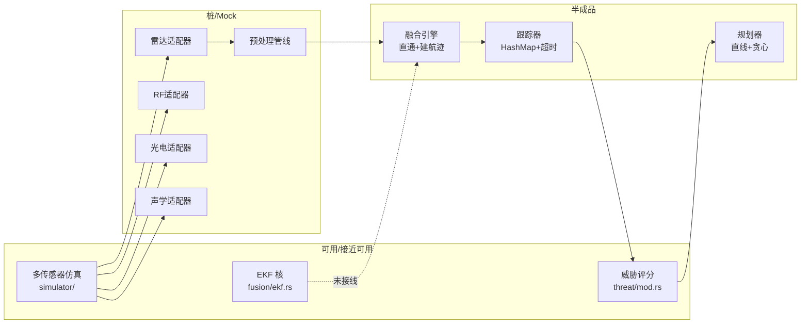

---

## 2. 端到端主流程（指标闭环）

对应指标链路：**探测 → 识别 → 多目标跟踪 → 威胁评估 → 任务规划 → 反制/拦截**

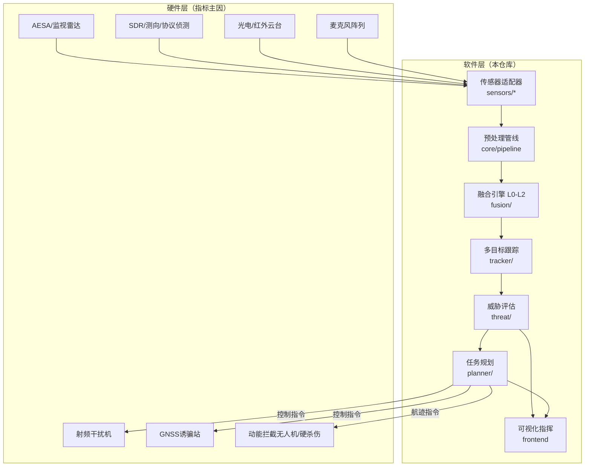

---

## 3. 分算法流程图

### 3.1 多传感器同步与联合定位（指标：探测距离≥6km、概率≥90%）

**设计意图**：PTP 时间对齐 → 各传感器独立检测 → 时空门控 → 联合定位。

**代码现状**：适配器 mock；仿真器用距离门控（雷达 8km）生成帧；无真实联合定位解算。

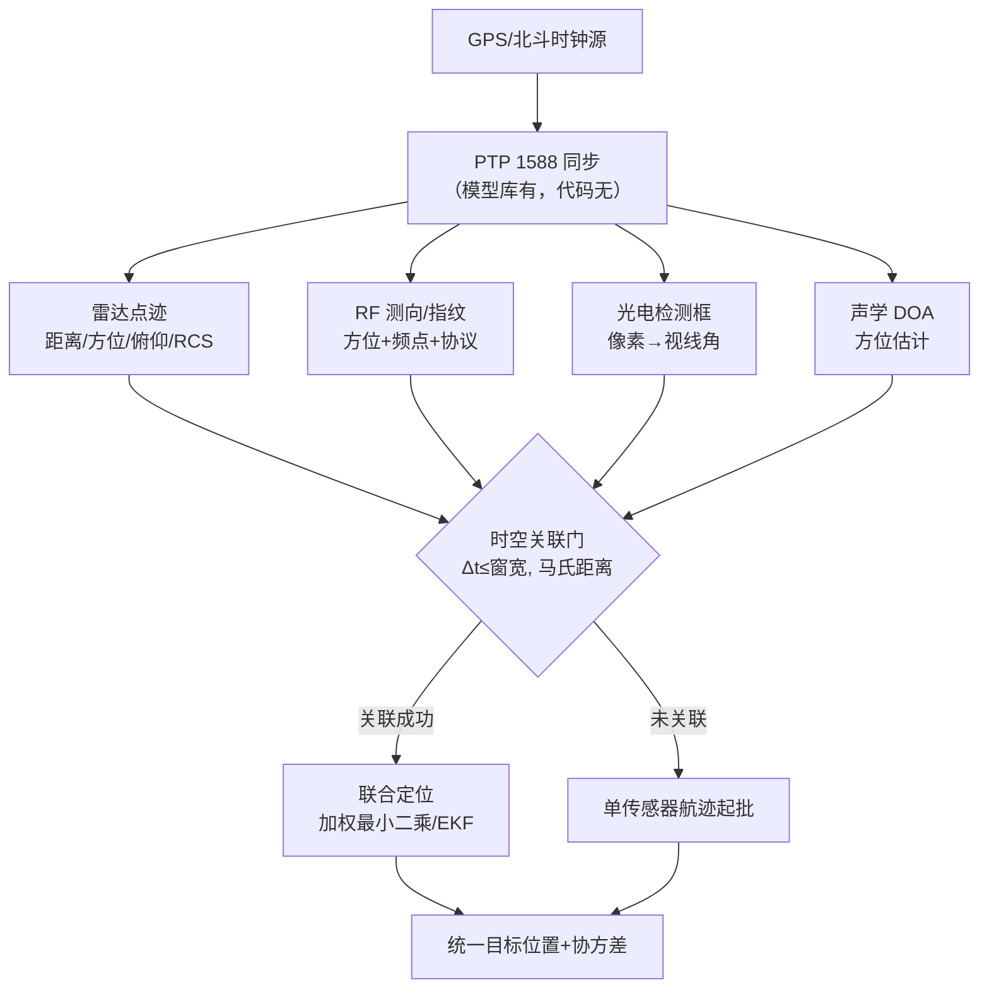

**硬件依赖（决定 6km/90%）**：

| 硬件 | 作用 | 不满足时的后果 |
|------|------|----------------|
| 雷达（功率、天线增益、波形、MTI/杂波抑制） | 主距离与发现概率 | 软件融合无法“算出”6km |
| RF 侦测灵敏度与测向精度 | 静默/低 RCS 目标补盲 | 仅靠雷达在山地/低空易漏 |
| 光电作用距离与能见度 | 识别确认 | 雾霾/夜间红外受限 |
| 站点选址与遮蔽 | 通视与多径 | 指标场景未定义则不可验收 |
| 时间同步硬件（GPSDO/PTP NIC） | 联合定位几何一致性 | 不同步导致融合发散 |

---

### 3.2 检测与识别（指标：总体识别率≥95%；非大疆≥20）

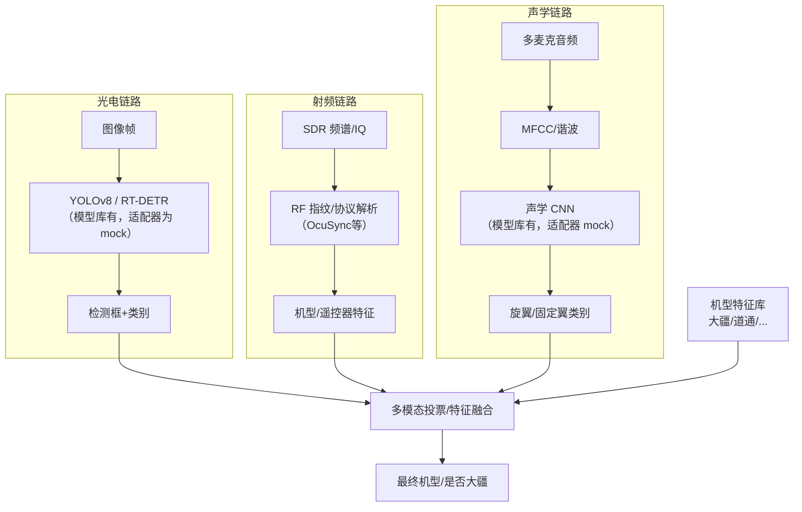

**硬件依赖**：

| 硬件 | 与识别率关系 |
|------|----------------|
| 光电分辨率/焦距/伺服跟踪 | 决定远距小目标可识别像素数；无足够像素则 YOLO 再强也达不到 95% |
| SDR 带宽、动态范围、天线 | 决定能否稳定提取指纹；抗干扰环境识别率陡降 |
| 声学阵列孔径与信噪比 | 仅近距有效，不能支撑 6km 级识别指标 |
| 真值标定设备（协同 ADS-B/Remote ID/已知机） | 无真值则“非大疆≥20”无法客观验收 |

---

### 3.3 数据融合与 EKF 跟踪滤波

**设计**：L0 关联（GNN/JPDA）→ L1 特征融合（EKF/IMM）→ L2 态势。

**代码**：L0 直通；L1 每帧新建 UUID 目标且速度置 0；`ekf.rs` 有完整 predict/update **但未调用**。

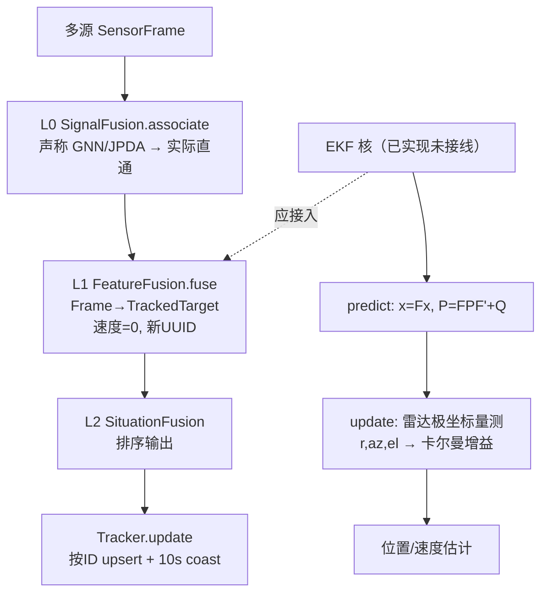

**EKF 内部流程（已实现）**：


---

### 3.4 多目标监测与跟踪（指标：同时≥30，非大疆≥20）

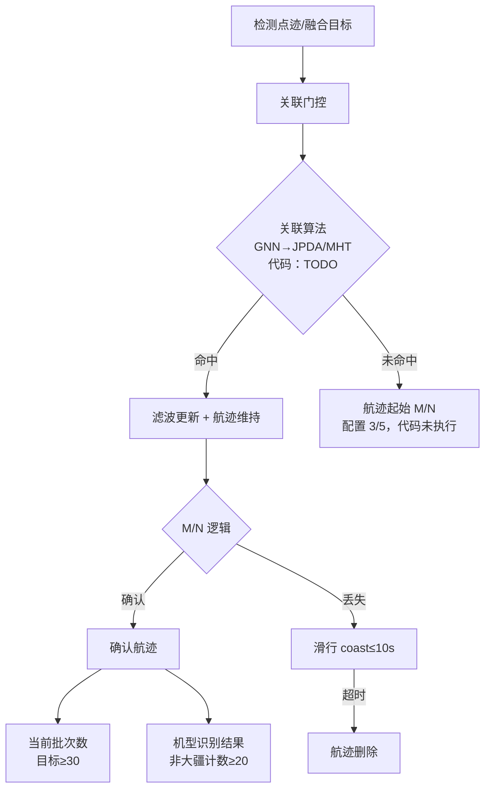

**硬件依赖**：批次数上限受雷达同时跟踪通道数、RF 可分辨信号数、计算平台吞吐共同限制；软件 `max_tracks=50` 只是配置上限，**不能替代硬件通道能力**。

---

### 3.5 威胁态势估计（指标：准确率≥90%，≤2s）

**后端真实公式**（`threat/mod.rs`）：

```
ThreatScore = 0.30·Intent + 0.25·Distance + 0.15·Speed
            + 0.10·Altitude + 0.10·Model + 0.10·Maneuver
RED ≥ 0.75; YELLOW ≥ 0.40; else GREEN
```

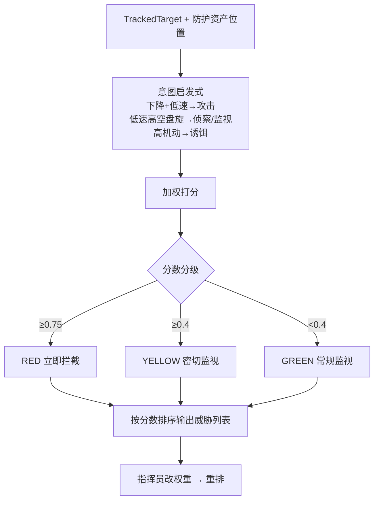

> 注意：前端 `wxdzcUtils.ts` 使用另一套 logistic 公式且红阈值为 **0.7**，与后端 **0.75** 不一致——属于实现缺陷，会影响“准确率”统计。

**硬件依赖（间接）**：威胁评估本身偏软件，但输入速度/距离/高度的精度完全依赖传感器与融合质量；若雷达测距误差大，距离权重 0.25 会系统性偏置等级。2s 时延预算需扣除传感器帧周期（雷达常见 1–10Hz）与网络传输。

---

### 3.6 反无任务规划（指标：单目标≤0.01s、多目标≤3s、成功率类≥98%、拦截≥90%、≥10 机）

**设计宣称**：RRT*/Hybrid A* + 匈牙利/PSO + VO 冲突消解。  
**代码实际**：中点直线航路 + 最近邻分配 + 冲突时抬高 50m。

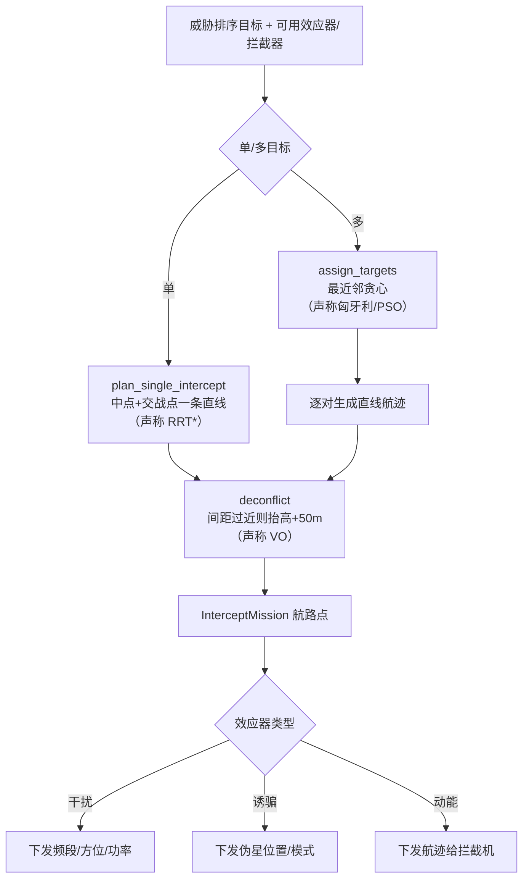

**设计态（应实现）RRT* 流程**：

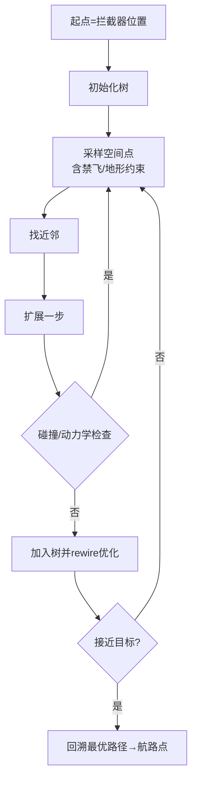

**硬件依赖（拦截成功率≥90% 的主因）**：

| 效应器 | 决定因素 | 软件能做的 |
|--------|----------|------------|
| 射频干扰机 | 功率、天线增益、指向精度、频段覆盖、法规可用带宽 | 选频、指向建议、时机、多站协同调度 |
| GNSS 诱骗 | 发射功率、同步精度、波形真实性、防护区几何 | 诱骗点计算、模式切换、白名单保护 |
| 动能拦截无人机 | 速度/过载/导引头/数据链 | 轨迹规划、冲突消解、任务分配 |
| 环境 | 天气、电磁对抗、城市多径、山地遮挡 | 场景感知与策略降级 |

**关于 ≤0.01s**：即便软件侧用查表/热启动，**有地形 DEM 的 RRT*** 也很难稳定 10ms；该指标与真实硬件在环（含链路往返）不兼容，应改为软件内核 P95 时延。

---

### 3.7 可视化指挥与交互（指标：100条/s、延迟≤0.5s、GIS 等）

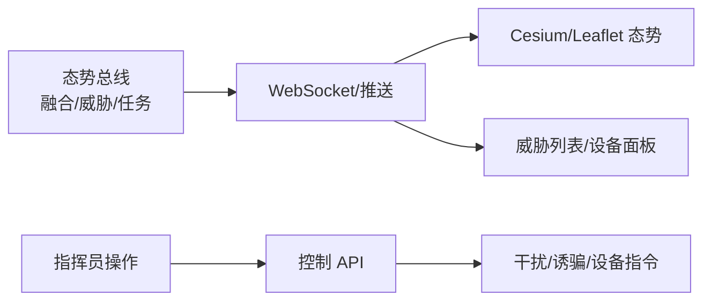

**硬件依赖**：电子地图瓦片/地形 DEM 存储与 GPU；视频依赖光电设备 RTSP 链路带宽；“非网络延时≤3s”仍受解码器与终端性能影响。

---

## 4. 技术指标 × 硬件依赖对照表（验收拆分建议）

| ★指标 | 软件可独立证明？ | 硬依赖 | 建议验收拆分 |
|-------|------------------|--------|--------------|
| 探测距离≥6km | 否 | 雷达/RF 作用距离、站址通视 | 硬件出厂/标定报告 + 软件在给定点迹下的融合可用率 |
| 探测概率≥90% | 否 | 传感器 SNR、杂波、RCS | 按场景库统计；软件测漏跟率/航迹连续率 |
| 识别率≥95% | 部分 | 光电像素、SDR 质量、样本库 | 离线数据集（含非大疆）测 Precision/Recall/FAR |
| 同时≥30/非大疆≥20 | 部分 | 传感器通道数、算力、真值布置 | 回放密集场景测稳定航迹数；外场降低批次数 |
| 威胁准确率≥90%/≤2s | 基本是软件 | 间接依赖航迹质量 | 专家标注集 + 分项时延；统一前后端公式 |
| 单目标规划≤0.01s | 软件 | 无（但指标过苛） | 改为 P95≤50–100ms（无 DEM）/≤200ms（含 DEM） |
| 多目标规划≤3s | 软件为主 | 算力平台 | 固定 N 目标×M 拦截器压力测试 |
| 路径/冲突≥98% | 软件+仿真 | DEM/禁飞区数据质量 | 仿真校验通过率；与实飞成功率分离 |
| 拦截成功率≥90% | **否** | 干扰/诱骗/动能效应器 | 系统联试指标；软件测指令正确率与闭环时延 |
| 同时规划≥10 拦截机 | 视装备 | 是否真有≥10 架拦截无人机 | 按实际效应器编制改写 |
| 策略热更新≤1h | 软件 | 无 | 改为“支持热更新+回滚”，删强制周期 |
| 无线电≥100条/s、延迟≤0.5s | 部分 | 采集前端与网络 | 分采集、总线、UI 三段测时延 |

---

## 5. 硬件接口现状（代码侧）

| 适配器 | 配置暗示 | 实际行为 | 对接缺口 |
|--------|----------|----------|----------|
| `sensors/radar.rs` | `tcp://radar-sim:9000`, 9.4GHz, 20km, 10Hz | 固定 mock 点迹 | 无厂商二进制/ASTERIX/私有协议解析 |
| `sensors/rf.rs` | `tcp://rf-sim:9001`, 2.4–5.85GHz | 固定频谱 | 无 IQ/测向数据流 |
| `sensors/eoir.rs` | `tcp://eoir-sim:9002`, 1080p30 | 固定检测框 | 无视频推理管线、无云台控制闭环 |
| `sensors/acoustic.rs` | `tcp://acoustic-sim:9003`, 4麦 48kHz | 固定特征 | 无实时音频采集 |
| 干扰/诱骗 | 原 Jeecg 系统有控制页 | 新栈以任务/设备 API 为主 | 需对接功率、频段、方位、诱骗模式等硬件寄存器/协议 |
| 时间同步 | 模型库 PTP | 无 | 缺 GPSDO/PTP 硬件与软件栈 |

原系统 `反无系统fj` 已具备干扰/诱骗业务页面与设备协议概念，迁移后的 Rust 栈仍以**仿真与 CRUD**为主，硬件闭环未完成。

---

## 6. 算法落地优先级（对应指标）

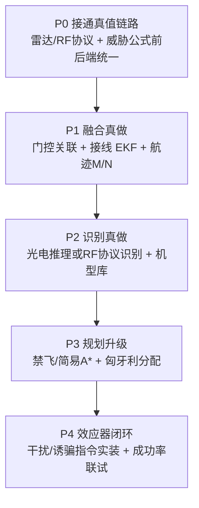

| 优先级 | 工作 | 解锁的指标 |
|--------|------|------------|
| P0 | 真实传感器协议 + 威胁公式一致 | 时延、评估可重复 |
| P1 | 关联 + EKF + M/N | 30 目标跟踪（在硬件通道允许下） |
| P2 | 识别模型实装 + 数据集 | 95% / 非大疆 20 |
| P3 | 可用规划（非直线） | 98% 可行性类（仿真） |
| P4 | 效应器硬件闭环 | 拦截成功率（系统级） |

---

## 7. 总结

1. **大模型已经生成了大量算法条目**（前端模型库约 30 项）和后端模块骨架；但多数“已部署”名不副实。  
2. **真正有算法内核的**主要是 EKF、威胁加权规则、仿真运动学；融合/跟踪/规划仍是简化实现。  
3. **流程图层面**应按“设计态流程”推进工程，同时用“代码态流程”做差距管理，避免按模型库验收。  
4. **指标中的硬件部分**必须单独剥离：6km/90%、识别率、拦截成功率不能压给纯软件；软件应验收融合质量、航迹连续、决策时延、指令正确率。
